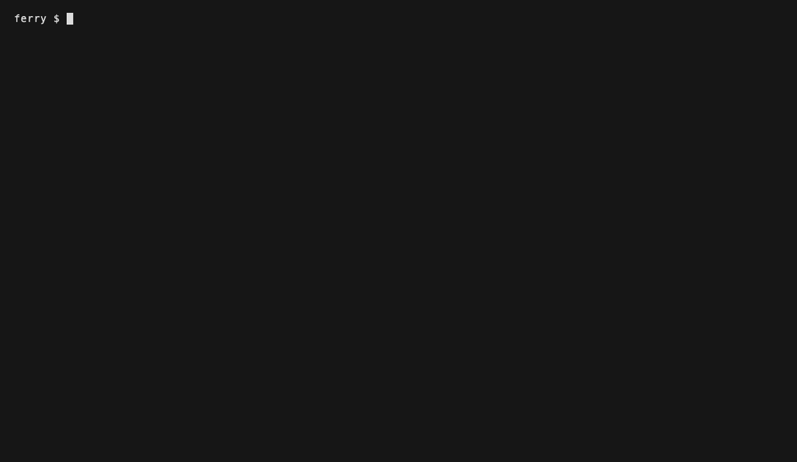
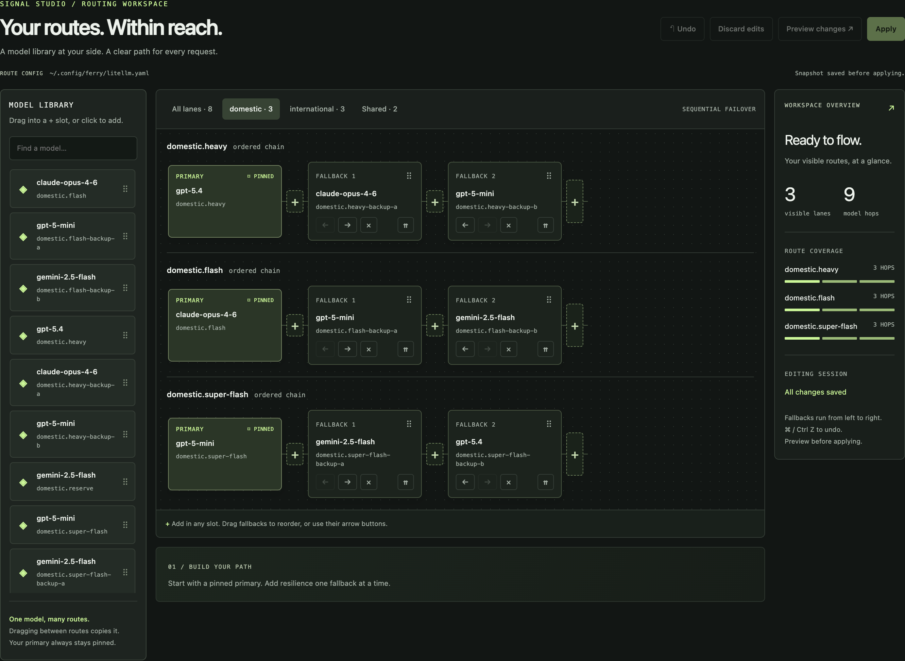
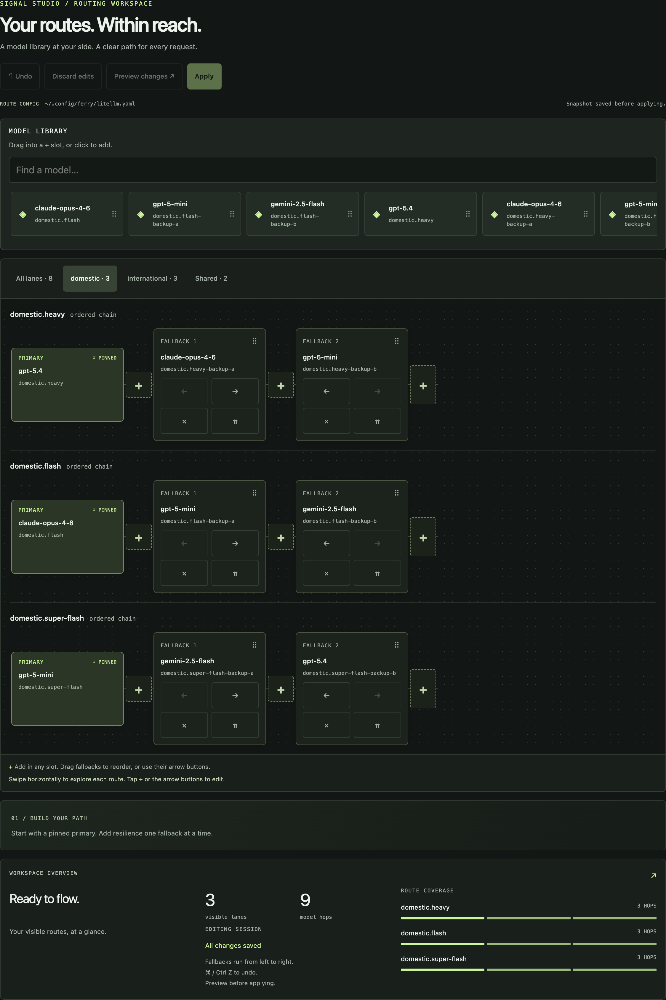
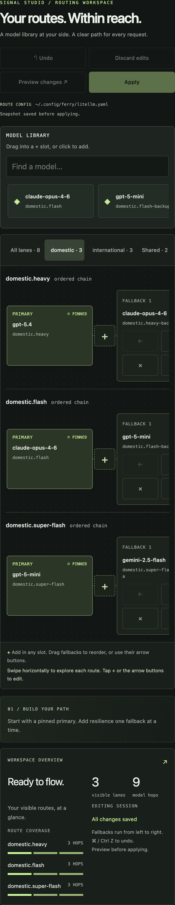
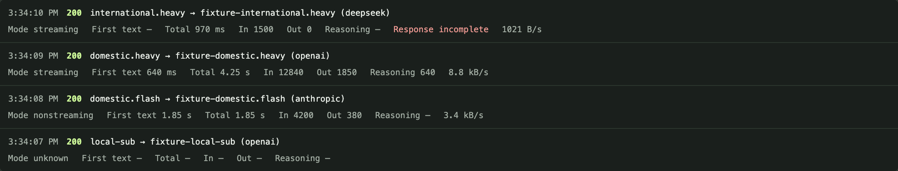

<h1 align="center">llm-ferry 🛥️</h1>

<p align="center">
  <b>Turn one Mac into a private AI gateway for your whole LAN.</b><br>
  Serve your cloud API keys <i>and</i> local GPU models to every device — from one OpenAI-compatible endpoint.<br>
  <b>Keys never leave the host. Clients join with one <code>curl</code>.</b>
</p>

<p align="center">
  <a href="https://github.com/sblattj/llm-ferry/stargazers"></a>
  <a href="https://github.com/sblattj/llm-ferry/releases"></a>
  <a href="https://github.com/sblattj/llm-ferry/commits/main"></a>
  <a href="https://github.com/sblattj/llm-ferry/issues"></a>
  <a href="LICENSE"></a>
  
  
  
</p>

<p align="center"></p>

<p align="center">
  <a href="docs/signal-studio.md"></a><br>
  <sub><b>Signal Studio</b> — build fallback routes, preview changes, and follow live requests. Actual dashboard capture with synthetic demonstration data.</sub>
</p>

<p align="center"><b>Design your fallback routes once — reach them from any screen.</b></p>
<table align="center">
  <tr>
    <td></td>
    <td></td>
  </tr>
  <tr>
    <td align="center"><sub>Drag fallback hops between ordered chains — tablet layout.</sub></td>
    <td align="center"><sub>Reroute a model from the couch — phone layout.</sub></td>
  </tr>
</table>

<p align="center">
  <br>
  <sub><b>Every request, accounted for.</b> First-text latency, in/out/reasoning tokens, and throughput per call — and when a lane degrades, you watch it light the next hop instead of erroring.</sub>
</p>

You have a strong Mac. You have other laptops. You have a drawer full of API keys copied onto every device. **llm-ferry** collapses all of that into one host: it runs models on your Mac's GPU (via [MLX](https://github.com/ml-explore/mlx)) **and/or** proxies to cloud providers behind the host's own keys, then exposes a single standard **OpenAI-compatible** API (`/v1/chat/completions`, `/v1/models`) that any laptop, editor, or device on the LAN can point at. One command on the host, one `curl | zsh` on each client, and everyone's tools just work — with the API keys staying on exactly one machine.

It goes further than serving inference: it can **ferry whole models and files** from the host to clients and **route a client's downloads through the host** — all over your private LAN.

## By the numbers

- **97 GB → 56 GB peak GPU** and **~60% faster decode** — the KV-cache governor, measured on a 128 GB M5 Max during a 121k-token agentic session (idle retained memory fell 57 GB → 35 GB).
- **Eight lanes, one endpoint** — local GPU *and* cloud models behind a single OpenAI-compatible API, each lane with strict named fallback chains.
- **Zero heavyweight dependencies** — a single-file CLI built from `zsh` + `python3` **standard library**; `litellm`/`mlx` arrive via `uv` only when you actually serve inference.

## Contents

- [Is this for you?](#is-this-for-you)
- [Why not just…?](#why-not-just)
- [Features](#features)
- [Quickstart](#quickstart)
- [Recent releases](#recent-releases)
- [The stack — eight lanes on one endpoint](#the-stack--eight-lanes-on-one-endpoint)
- [Fleets](#fleets)
- [The local GPU lanes](#the-local-gpu-lanes)
- [Dashboards & observability](#dashboards--observability)
- [Encrypted transfer off the LAN](#encrypted-transfer-off-the-lan--ferry-drop--ferry-pickup)
- [Ports](#ports)
- [Ferrying models & files across the LAN](#ferrying-models--files-across-the-lan)
- [Route a client's downloads through the host](#route-a-clients-downloads-through-the-host)
- [Reverse expose: publish a client's port through the host](#reverse-expose-publish-a-clients-port-through-the-host)
- [Remote access (Tailscale)](#remote-access-tailscale)
- [Local models — operating notes](#local-models--operating-notes)
- [Platform support](#platform-support)
- [Device keys](#device-keys)
- [Privacy](#privacy)
- [Command reference](#command-reference)
- [FAQ](#faq)
- [Contributing](#contributing)
- [Acknowledgments](#acknowledgments)
- [Development](#development)
- [License](#license)
- [Deep dives](docs/deep-dives.md) — client-wiring scopes, route forensics, plugin-cache archaeology, measured known issues

## Is this for you?

- 🧑‍💻 **You have more than one machine.** A beefy Apple Silicon Mac plus laptops that should borrow its GPU and its keys instead of each hoarding their own.
- 🏠 **You run a home lab.** One box becomes the inference appliance; everything else is a thin client.
- 👥 **A small team wants to share one set of API keys.** Centralize billing and secrets on a host; clients never see a key.
- 🤖 **You do agentic coding and want cheap + smart on tap.** Serve a big **orchestrator** model and a pool of cheap **workers** on the same endpoint, and let your agent fan out across both.
- 🔒 **Mac/Linux host, LAN-only, your hardware.** Client↔host traffic is plain HTTP on your private network behind a ferry key (the master key or a per-device key); cloud calls go host→provider over HTTPS with the host's keys. This is not a public gateway or a hosted service — and that's the point.

## Why not just…?

`llm-ferry` is built **on** LiteLLM and MLX — it's the glue that turns them into a shared LAN appliance. Honest comparison of **focus**, not "better":

| Capability | Per-device API keys | [Ollama](https://ollama.com) / [LM Studio](https://lmstudio.ai) | Raw [LiteLLM](https://github.com/BerriAI/litellm) proxy | [OpenRouter](https://openrouter.ai) (hosted) | **llm-ferry** |
|---|:---:|:---:|:---:|:---:|:---:|
| Keys stay on **your** hardware | ✗ *(on every device)* | n/a | ✓ | ✗ *(3rd party sees traffic)* | ✓ |
| Local GPU model serving | — | ✓ *(GGUF)* | — | — | ✓ *(MLX)* |
| Cloud provider proxy | ✓ *(each device)* | — | ✓ | ✓ | ✓ |
| Local **and** cloud on **one** endpoint | — | — | — | — | ✓ |
| One-command LAN client onboarding | — | — | — | — | ✓ |
| Named lanes + strict fallback hops | — | — | ✓ *(hand-config)* | partial | ✓ *(+ bundled skills)* |
| Multi-key worker pool, least-used + auto-cooldown | — | — | ✓ *(hand-config)* | n/a | ✓ *(template)* |
| Ferry models/files across LAN + forward proxy | — | — | — | — | ✓ |
| Cost | — | free | free | paid markup | free · OSS |

Ollama and LM Studio are excellent local runtimes; a raw LiteLLM proxy is a great cloud gateway; OpenRouter is a fine hosted aggregator. `llm-ferry` is for the specific job none of them targets: **sharing one Mac's local + cloud models across a LAN**, with the client onboarding, routing, and file/model ferrying that job needs — preconfigured.

## Features

- 🧾 **Run on your subscriptions, not just API keys** — ChatGPT- and Claude Pro/Max-subscription lanes log in once over OAuth (`ferry auth-claude login`); each carries metered fallback hops so an exhausted subscription degrades to pay-per-token instead of erroring the client. [[releases]](docs/releases/v1.37.0.md)
- 🌐 **One endpoint, every device** — OpenAI-compatible (`/v1/chat/completions`, `/v1/models`); Anthropic `/v1/messages` too, so **Claude Code runs on the ferry backend** (`claude-ferry` wrappers). [[The stack →]](#the-stack--eight-lanes-on-one-endpoint)
- 🧩 **Cline (VS Code) wired too** — `ferry cline` (or a plain bootstrap) points the Cline extension at the ferry endpoint by lane name, writing its file-backed provider config with snapshots first. [[Release →]](docs/releases/v1.40.0.md)
- 🤖 **Codex CLI and Prime Agent wired too** — `ferry codex` installs `codex-ferry` (heavy) / `codex-ferry-flash` wrappers (Codex's `/goal` works through them); `ferry prime` adds a `ferry` provider to Prime Agent's `models.json`. [[Release →]](docs/releases/v1.41.0.md)
- 🔑 **Keys stay on the host** — provider keys never leave the host; each client holds one ferry key — its own revocable [device key](#device-keys), or the shared master key on older setups. [[Privacy →]](#privacy)
- ⚡ **Local GPU + cloud, same endpoint** — Apple MLX inference on the Mac, or a cloud proxy, or both in one route config. [[Local GPU lanes →]](#the-local-gpu-lanes)
- 🧠 **Named lanes with explicit fallback hops** — clients pick a role (`heavy`, `flash`, …); you swap the backends without editing a single client. [[The stack →]](#the-stack--eight-lanes-on-one-endpoint)
- 🗺️ **Fleets** — switch every cloud lane between routing sets (e.g. `domestic` ↔ `international`) per caller, mid-session, no restart. [[Fleets →]](#fleets)
- 🎛️ **Multi-key worker pool** — pooled deployments with least-used spread and automatic 429 cooldown/failover.
- 🚀 **One-curl client onboarding** — installs the CLI, writes the client profile, and auto-wires the editor (opencode / Claude Code / Cline in VS Code / Codex CLI / Prime Agent). [[Quickstart →]](#quickstart)
- 🎨 **Signal Studio route editor** — search your model library *and* the live public OpenRouter catalog, add/reorder/copy fallback hops, undo, preview the exact YAML diff, apply. Desktop, tablet, and phone layouts. [[Tour →]](docs/signal-studio.md)
- 📊 **See each request clearly** — first-text latency, duration, and reported tokens in the live dashboard; optional Grafana + VictoriaMetrics + VictoriaLogs for persistent observability. [[Dashboards →]](#dashboards--observability)
- 📦 **Ferry models & files across the LAN** — stream whole models from the host's HuggingFace cache, offer/fetch arbitrary files, or push over netcat. [[→]](#ferrying-models--files-across-the-lan)
- 🕳️ **Forward proxy for offline clients** — route a client's uv/PyPI/HuggingFace/git downloads through the host's connection. [[→]](#route-a-clients-downloads-through-the-host)
- 🔄 **Reverse tunnel for locked-down clients** — publish one of a client's own ports through the host, with the client only ever dialling out (`ferry relay` / `ferry expose`); browser VNC included, so a phone needs only a URL. [[→]](#reverse-expose-publish-a-clients-port-through-the-host)
- 🔐 **Encrypted drop for machines off the LAN** — `ferry drop` writes an authenticated, self-contained blob movable over any channel; `ferry pickup` verifies and decrypts it. The passphrase, not the carrier, is the security boundary. [[→]](#encrypted-transfer-off-the-lan--ferry-drop--ferry-pickup)
- 🪶 **Single-file CLI** — `zsh` + `python3` standard library only; clients fetch the CLI as one script over the LAN.

## Quickstart

**1 · Host (your Mac).** One line installs `uv`, MLX inference (`mlx-vlm`), the cloud proxy (`litellm`), and links the `ferry` CLI globally. The local GPU lanes are **opt-in**: the ~42 GB of local models are downloaded only with `--with-local` (or `FERRY_LOCAL=1`):

```bash
curl -fsSL https://github.com/sblattj/llm-ferry/archive/refs/heads/main.tar.gz | tar xz && ./llm-ferry-main/host-bootstrap.sh
# or: git clone https://github.com/sblattj/llm-ferry.git && cd llm-ferry && ./host-bootstrap.sh
```

For cloud mode, set a provider key (never commit it) and start serving:

```bash
export OPENROUTER_API_KEY="..."      # or drop it in ~/.config/ferry/secrets.env
ferry auth-claude login              # optional: Claude Pro/Max subscription lanes (browser OAuth)
ferry up                             # serve the cloud lanes (local GPU lanes stay off); `ferry up -i` = pick from the live model catalog
ferry share                          # print the one-liner clients run (LAN share server on 8095)
```

**2 · Client (any other laptop on the same LAN).** Run the command `ferry share` prints — it embeds your host's live mDNS name and share port:

```bash
curl -fsSL http://your-mac.local:8095/client-bootstrap.sh | zsh
```

The bootstrapper is non-interactive when the host is reachable: it installs the `ferry` CLI to `~/.local/bin`, writes `~/.config/ferry/client.json`, wires opencode to the host endpoint, and adds `opencode-cloud` / `opencode-local` / `opencode-super` shell shortcuts — and, when `claude` is installed, `claude-ferry` / `claude-ferry-local` / `claude-ferry-super`. Cline in VS Code is auto-wired the same way (`ferry cline`'s takeover; skip with `--no-cline`, and close VS Code for the run). The Codex CLI gets `codex-ferry` / `codex-ferry-flash` wrappers in `~/.zshrc` (`--no-codex` skips; installed even before Codex is — `npm i -g @openai/codex`), and Prime Agent gets a `ferry` provider in its `models.json` (`--no-prime` skips; installed even before prime-agent is). Bare `opencode`, `claude` and `codex` are deliberately untouched. Then check in:

```bash
ferry status                     # connection health + the lanes the host serves
ferry msg "note"                 # send a quick note to the host's log
some-command 2>&1 | ferry log    # stream logs/errors back to the host
```

That's it — every editor and CLI on the client now talks to one endpoint on the host. Narrower takeover scopes, catch-ups, and full removal (`client-reset.sh` / `client-cleanup.sh`): [Deep dives](docs/deep-dives.md#opencode-takeover-scopes); the host reads client telemetry back with `ferry inbox` ([attribution internals](docs/deep-dives.md#reading-what-the-clients-sent)).

> If ferry replaced your key-sync ritual, [⭐ star the repo](https://github.com/sblattj/llm-ferry). It helps other people find it.

## Recent releases

- **[v1.39.0 — per-device keys](docs/releases/v1.39.0.md)** — every client gets its own revocable key at bootstrap, with optional lane, requests-per-minute and monthly token limits; `ferry keys` manages them and the dash shows who spent what.
- **[v1.38.0 — safe help, clean pipes, named offers](docs/releases/v1.38.0.md)** — `--help` never runs a subcommand, colour only on a terminal, `ferry offer --as NAME` with `.app` signatures intact, and releases cut automatically on tag push.
- **[v1.37.0 — Claude subscription lanes](docs/releases/v1.37.0.md)** — `ferry auth-claude login` serves `claude-*` traffic from a Claude Pro/Max subscription over OAuth, with metered fallback hops. [Full history →](docs/releases)

## The stack — eight lanes on one endpoint

`ferry up -c/-m` serves **one** model. Plain **`ferry up`** serves the **cloud lanes** of the stack. **`ferry up --with-local`** (or `FERRY_LOCAL=1` in the shell or `~/.config/ferry/secrets.env`, which makes a plain `ferry up` do the same) serves the full **stack**: eight named **lanes** on a single OpenAI-compatible endpoint, driven by a [LiteLLM config](https://docs.litellm.ai/docs/proxy/configs) plus three local MLX servers. **The three local GPU lanes (~42 GB of weights) never start or download unless you opt in.**

| Lane | Where it runs | What it is |
|---|---|---|
| **`heavy`** | cloud | The driving model; the domestic template has one fallback on the same ChatGPT subscription |
| **`medium`** | cloud | General work when advertised; the domestic template runs GPT-5.6 Terra at xhigh with an OpenRouter Terra fallback |
| **`flash`** | cloud | Explore worker; the domestic template runs GPT-5.6 Luna at xhigh, then Gemini Flash Latest, then Terra |
| **`super-flash`** | cloud | Compaction, title, and summary; `openrouter/~google/gemini-flash-latest` at minimal reasoning with throughput routing and no fallback |
| **`schematron`** | host GPU | HTML→JSON structured extraction at temperature 0, **on-machine** (`pchamart/schematron8B-mlx-8bit`, an 8-bit MLX quant, on internal port 8100); no fallback; used by cdp-toolkit `extract_page` |
| **`schematron-cloud`** | cloud | The same extraction job off-box (`openrouter/inference-net/schematron-v2-turbo`, temperature 0). A lane you ask for **by name** — nothing falls back to it, deliberately |
| **`local-orch`** | host GPU | The smart local model (Qwen 3.8-27B nvfp4 + MTP speculative draft) |
| **`local-sub`** | host GPU | The cheap local fan-out model (Nemotron 3 Nano 30B A3B NVFP4) |

A lane **name is the contract** — the model behind it is swappable on the host without editing a single client, which is why lanes are named for their *role*, not a model id: clients just send `{"model":"local-sub",…}` to the endpoint like any OpenAI model.

**How it fits together.** LiteLLM on `:8090` is the only door. The three GPU lanes are `mlx_vlm.server` processes on internal loopback ports that LiteLLM fronts as ordinary OpenAI-compatible backends — a local and a cloud model are indistinguishable to a client apart from the name it asks for. The extraction lane can also run **beside** the stack on its own door (`:8094`) with `ferry up --schematron`, so a scraper workload never disturbs the main endpoint. The first run seeds `~/.config/ferry/litellm.yaml` from [`litellm-route-example.yaml`](litellm-route-example.yaml) and **stops** for you to edit it — the `domestic.heavy`/`domestic.medium` primaries log in through the ChatGPT device-code session (no API key); the OpenRouter routes want `OPENROUTER_API_KEY` — then re-run.

Routing rules the template ships with (each with full forensic detail in [Deep dives](docs/deep-dives.md#route-config-forensics)):

- **Every cloud lane has a fallback entry**; the local lanes are deliberately outside every chain — a stopped GPU lane surfaces as an error rather than quietly spending a cloud quota.
- **Worker pools load-balance**: deployments sharing a `model_name` form a pool — least-used spread, automatic 429 cooldown — and OpenRouter deployments route to the fastest provider (`provider.sort: throughput`), re-ranked on OpenRouter's side every request.
- **Only lanes are advertised**: `/v1/models` lists lanes marked `model_info: {public: true}` and never a fallback hop, via a small ASGI filter — not a second process.
- **⚠ An alias has no fallback chain** — litellm resolves fallbacks by the raw model string, *before* alias resolution. Duplicate the deployment instead of aliasing it.
- ChatGPT-bridge lanes carry **ferry's neutral preamble** instead of litellm's injected Codex prompt — [what replaces it and how to verify](docs/deep-dives.md#claude-code-wiring--the-chatgpt-bridge).
- LiteLLM only **routes and fails over** — the agent logic lives in your client, and the bundled skills ([`add-fallback-orchestrator`](.claude/skills/add-fallback-orchestrator/SKILL.md), [`add-worker-model`](.claude/skills/add-worker-model/SKILL.md)) walk Claude Code through editing your `litellm.yaml` correctly.

**opencode auto-wiring.** `ferry opencode` takes opencode's config over so **every** agent routes through the host (`--local` picks the GPU pair). It is a **surgical takeover, not a merge**: four keys are replaced outright (`model` → `ferry/<driver>`, `small_model` → the inexpensive lane, `permission`, `agent`); everything else — `mcp`, `lsp`, `theme`, your own keys — is left exactly as it was, and the previous config is snapshotted before every write. Agent → lane map:

| role | agents | cloud | GPU |
|---|---|---|---|
| driver | `build`, `plan` | `heavy` | `local-orch` |
| light (0-50) | `light` | `flash` | `local-sub` |
| standard (51-100) | `standard` | `medium` when advertised; otherwise `flash` | `local-sub` |
| explore | `explore` | `flash` | `local-sub` |
| compaction / title / summary | `compaction`, `title`, `summary` | `super-flash` | `local-sub` |

The goal plugin the takeover installs is [`opencode-goal-pro-max-complete-plugin`](https://github.com/sblattj/opencode-goal-pro-max-complete-plugin) v1.2.0. It was renamed from `sblattj/OpenCode-goal-plugin`, and that repo is gone. Old spellings are migrated. If your config already loads the plugin from a local path or `file://` URL (for example from the plugin's own installer), ferry writes no remote spec, removes any that is there, and skips the pre-install. It has its own forensic history — [install internals](docs/deep-dives.md#the-opencode-goal-plugin-install-internals).
## Fleets

A **fleet** is a complete routing set — a primary and a fallback entry for every cloud lane (`heavy`, `medium`, `flash`, `super-flash`) — living in the same `litellm.yaml`, distinguished only by a `<fleet>.<lane>` prefix on deployment names. Clients keep sending bare lane names exactly as before; the front door resolves each request from an explicit `X-Ferry-Fleet` header, the caller's own sticky selection, or the host-wide default. Any session can move between fleets without a config edit or a restart.

| Template fleet | `heavy` | `medium` | `flash` | `super-flash` |
|---|---|---|---|---|
| `domestic` | GPT-6 Astra → GPT-5.6 Sol, both on the ChatGPT subscription at `xhigh` | GPT-5.6 Terra on the ChatGPT subscription (`xhigh`) → GPT-5.6 Terra on OpenRouter (`xhigh`); used by standard when advertised | OpenRouter GPT-5.6 Luna (`xhigh`) → Gemini Flash Latest (`xhigh`) → GPT-5.6 Terra (`xhigh`); used by light and explore | `openrouter/~google/gemini-flash-latest` (`minimal`, throughput); deliberate empty fallback list; used by compaction/title/summary |

Generic tier names also work as bare model names: `light` is an alias for `flash` and `super-light` for `super-flash` (as `orch`/`orchestrator` are for `heavy`), resolved through the same fleet rules and limited/metered as their target lane. They are not listed in `/v1/models`.

```bash
ferry fleet ls                    # list fleets, primaries, the default, and `keys missing` if unset
ferry fleet show                  # who am I, my resolved fleet, every client's selection
ferry fleet use international     # this caller follows `international` from now on
FERRY_FLEET=international opencode-super   # one-shot pin, regardless of sticky selection
```

Fleet internals — sticky-selection vs `FERRY_FLEET` visibility, the headerless-Tailscale edge case, international-fleet guidance — in [Deep dives](docs/deep-dives.md#fleets--configuration-detail).

## The local GPU lanes

The local GPU lanes are **opt-in**. All three run under `mlx-vlm` and start together with `ferry up --with-local` (or a plain `ferry up` when `FERRY_LOCAL=1`); each can also be served alone on `:8090` with `ferry up --local-orch` / `--local-sub` / `--local-schematron`. Fetch the weights with `ferry install --with-local`. `./host-reset.sh --full` relaunches them only if you opted in or they were already running.

- **`local-orch` — Qwen 3.8-27B nvfp4** (~15 GB) with an MTP speculative draft model. The heavier, more capable local model, and the only local lane with a drafter.
- **`local-sub` — NVIDIA Nemotron 3 Nano 30B A3B NVFP4** (~18 GB). A `nemotron_h` hybrid MoE whose KV cache is ~6 KB/token — under 1 GB per 128k-token agent stream — which is what makes it the right lane for **concurrent subagents**.
- **`schematron` — Schematron-8B, 8-bit MLX** (~8.5 GB). An HTML→JSON structured-extraction fine-tune of Llama-3.1-8B with an unquantized KV cache for verbatim copying out of the prompt. The model expects the JSON schema inside the user message; ferry fronts it verbatim and rewrites no prompts.

All three are **defaults** — swap any of them for an MLX-compatible model your Mac's unified memory can hold via `LOCAL_MODEL_ORCH` / `LOCAL_MODEL_SUB` / `LOCAL_MODEL_SCHEMATRON` in `lib/ferry-core.zsh` (then `./build.zsh`). Running all three keeps ~42 GB of weights resident before any KV cache; the governor below keeps that safe, with per-lane overrides (`LOCAL_SUB_MAX_KV`, …) to shrink one lane without touching the others.

## Dashboards & observability

```bash
ferry dash --open              # live web dashboard at http://localhost:8091
FERRY_EVENTS=on ferry up       # arm the per-request event tap, then re-open dash
ferry dash --grafana --open    # full Grafana + VictoriaMetrics + VictoriaLogs stack
```

- **Signal Studio** puts the configured model library, editable fallback routes, and live traffic in one local workspace. Its library also searches the live [public OpenRouter catalog](https://openrouter.ai/docs/api/api-reference/models/list-all-models-and-their-properties) — model IDs, context length, pricing, capabilities. Drag or tap to add/reorder/copy hops, undo, keep the primary pinned until you explicitly promote another backend, then **Edit → Preview changes → Apply** with a snapshot saved before writing. Fleet tabs filter the routes in view; tablet and phone layouts included. [Open the Signal Studio guide →](docs/signal-studio.md)
- **Live traffic** (event tap on): every public lane drawn as its chain of hops — the served hop lit green, the hops it walked past lit red with the status code that pushed it on — plus per-deployment health and a feed of the last 200 requests with first-text latency, total duration, streaming mode, and reported input/output/reasoning tokens. The tap is **off by default**, forwards every request unmodified, and drops rather than ever blocking a response.
- **Schema repair, recorded**: the front patches tool schemas a provider is known to reject *without an error* (e.g. Gemini's `array_without_items`) and records what it found — forensics in [Deep dives](docs/deep-dives.md#event-tap-schema-repair--attribution).
- **Grafana stack** on localhost (`:3001`, login `admin` / `ferry-observ`): request-rate, error-rate, and latency dashboards, per-model usage (requests, tokens, spend), a **Failures & Fallbacks** view, and searchable proxy logs, persisting across sessions. All OSS, $0. See [`observ/README.md`](observ/README.md).

## Encrypted transfer off the LAN — `ferry drop` / `ferry pickup`

For machines that aren't on your network at all — a cloud desktop, a VDI, a locked-down work laptop that can only make outbound requests:

```bash
ferry drop brief.md                   # -> brief.md.ferrydrop + a fresh passphrase
ferry drop --msg "the API is at :8090"
# on the other machine, once the blob has arrived by any means at all:
ferry pickup brief.md.ferrydrop
```

Ferry supplies **confidentiality, not delivery** — a deliberate limit that keeps it free of any account, credential file, or third-party service. The blob is AES-256-CBC with PBKDF2 (600k iterations) plus an HMAC-SHA256 over header and ciphertext, verified *before* the decrypt path runs; a modified blob fails closed. **The passphrase is the entire security boundary**, so send it by a *different* channel than the blob. Needs only `openssl` (stock macOS LibreSSL and OpenSSL 3.x blobs are mutually decryptable). Full format and exit-code detail: [Deep dives](docs/deep-dives.md#encrypted-drop--crypto-detail).

## Ports

**8090** endpoint · **8091** dashboard · **8094** extraction door · **8095** LAN share · **8096** HF proxy · **8097** forward proxy · **8098** relay · **8099** VNC viewer · **8101** default tmux/ssh publish port · **8092/8093/8100** internal MLX backends · **9099** netcat — the full table with who starts each: [Deep dives](docs/deep-dives.md#ports).

## Ferrying models & files across the LAN

`ferry` moves whole models (from the host's local HuggingFace cache) and arbitrary files/dirs from the **host** to a **client**, over three transports:

```bash
ferry pull mlx-community/Qwen3.8-27B-nvfp4 --host your-mac.local   # http: stream from the host's HF cache (8095)
ferry pull org/model --host your-mac.local --transport hf          # EXPERIMENTAL: through the host's HF proxy
ferry offer ~/datasets/eval.jsonl                                  # host: record files for clients (name = basename)
ferry offer --as evals ~/datasets/v2                               # host: choose the name clients ask for
ferry get eval.jsonl --host your-mac.local --to ./data             # client: fetch by name
ferry receive --port 9099 --to ./incoming                          # direct push: client listens (netcat)
ferry send ~/some/dir client-laptop.local --port 9099              # ...then the host pushes
curl -fsS http://your-mac.local:8095/manifest                      # plain curl too: cached models + offered files
```

`ferry serve-hf` (experimental) is a pass-through proxy to `https://huggingface.co` (port 8096, LFS→CDN redirects followed), so a client with `HF_ENDPOINT=http://<host>:8096` downloads *through* the host.

## Route a client's downloads through the host

A client with no (or limited) internet pulls its own dependencies and models *through* the host — **anything that honors the standard proxy env vars**, routed via the host's own connection, no caching:

```bash
ferry serve-proxy                            # host
eval "$(ferry env)"                          # client: HTTP(S)_PROXY / HF_ENDPOINT / NO_PROXY exports
uvx whosaid ...                              # uv/PyPI, huggingface_hub, git, curl — via the host
```

`ferry env` stays `eval`-able (`--write` persists into `~/.zshrc`); HTTPS goes via `CONNECT` tunneling with backpressure, so a CDN pushing a multi-GB model cannot outrun a slower LAN client.

## Reverse expose: publish a client's port through the host

Every other feature pushes **host → client**. This is the missing direction: a locked-down laptop that can only make **outbound** connections dials the host, and the host does the listening.

```bash
ferry relay                                  # host: accept registrations, publish ports
ferry expose 4290 --as 4290 --token <token>  # client: serve 127.0.0.1:4290 from the host

ferry expose-vnc --token <token>   # client: publish the screen (RFB preflight, kind: vnc)
ferry serve-vnc --fetch            # host, once: download the pinned noVNC release
ferry serve-vnc                    # host: browser VNC viewer + WebSocket bridge on 8099

ferry expose-tmux --token <token>  # client: publish an sshd (system one if Remote Login is on, else a no-sudo one; kind: tmux)
ferry tmux                         # host: ssh in through the relay and attach a tmux session
ferry tmux --dir '~/code/foo'      # same, but a NEW session starts in that client directory (~ = the client's home)
```

For `expose-tmux`, ssh is what authenticates and encrypts. Remote Login is no longer required: with it off (or with `--user-sshd`) the client runs its own no-sudo sshd on `127.0.0.1`, pubkey-only, trusting just the host's ferry key (`~/.config/ferry/tmux_ed25519`, made by `ferry relay` and fetched over the relay), and stops it with the tunnel; `--system-sshd` forces the system sshd on port 22. The token authenticates the client that *registers* — expose something with its own auth. Ferry's own ports are refused as publish targets outright. Published ports bind the LAN by default (`--bind 127.0.0.1` keeps an exposure host-local); `ferry status` lists them, `ferry down` tears the relay down. How the bytes move, teardown semantics, and the VNC security model: [Deep dives](docs/deep-dives.md#reverse-expose--how-the-bytes-move).

## Remote access (Tailscale)

The endpoint is a LAN appliance; ferry publishes nothing to the internet. When you want it from *outside* the LAN, front it with [Tailscale Serve](https://tailscale.com/kb/1242/tailscale-serve) — one command on the host puts a real TLS certificate and your tailnet's identity in front of the same local port:

```bash
# host: serve the endpoint over the tailnet
tailscale serve --bg --https=443 http://127.0.0.1:8090

# client: re-point client.json at "your-mac.<tailnet>.ts.net", then regenerate with the real key
ferry opencode --key <master-key>     # or: ferry claude --key <master-key>
```

**What this does not cover:** the share server (`8095` — bootstrap, `pull`/`get`, `/hq` telemetry), the relay (`8098`), and the download proxies stay LAN-only — a remote client can drive inference but cannot bootstrap, ferry files, or send telemetry. This is a documented recipe, not an integration: ferry does not install, start, or manage Tailscale for you.

## Local models — operating notes

**KV-cache memory governor:** local launches ship with `--kv-bits 4`, `--max-kv-size 131072`, `--max-num-seqs 4`, and `APC_NUM_BLOCKS=512`. Measured on a 128GB M5 Max during a 121k-token agentic session: peak GPU footprint dropped **97 GB → 56 GB**, idle retained memory fell **57 GB → 35 GB**, and decode ran **~60% faster**. Monitor live usage with `footprint <pid>` (`ps` RSS does not show Metal wired memory) — `ferry status` prints it per lane. Disable any knob by setting it to `""` in `lib/ferry-core.zsh`, or govern one lane only with the per-lane overrides (`LOCAL_ORCH_MAX_KV`, `LOCAL_SUB_MAX_SEQS`, …).

Measured known issues — the `local-orch` deep-prefill streaming crash (self-recovering), the MTP-draft + quantized-KV crash and the config it shipped to avoid it, empty `/compact` summaries on huge sessions, and the auto-patched `nemotron_h` batching bug — live in [Deep dives](docs/deep-dives.md#local-model-known-issues).

## Platform support

| Platform | Local MLX serving | Cloud proxy · route · dash · client wiring · LAN share/transfer |
|---|:---:|:---:|
| **macOS (Apple Silicon)** | ✓ | ✓ |
| **Linux / Ubuntu** | — *(macOS only)* | ✓ |

**Local GPU serving uses Apple MLX and is macOS / Apple Silicon only.** On Linux, `ferry up --with-local` automatically degrades to the cloud lanes (a plain `ferry up` is already cloud-only); serve models with `--route`, `--cloud`, or `--model <id>` against a cloud / OpenAI-compatible endpoint instead. `ferry install` skips the model downloads unless you pass `--with-local` (or set `FERRY_LOCAL=1`); on Ubuntu it also skips MLX, and may prompt you to `apt install zsh` (ferry is a zsh script); `avahi-daemon` (so `.local` mDNS names resolve) and `iproute2` are recommended.

## Device keys

Every client can hold **its own key** instead of the shared master key, so you can see which device spent what, cut off one lost laptop without re-keying the rest, and optionally cap a device.

- **Getting one is automatic.** Run the client bootstrap with the master key (`FERRY_MASTER_KEY=… curl …/client-bootstrap.sh | zsh`). A v1.39.0 host mints a device key named after the machine and the client stores only that (`api_key` in `~/.config/ferry/client.json`, written 0600), never the master. On a client that was bootstrapped before v1.39.0, the migrating run also redacts the old master key in ferry's config backups (`<name>.<UTC>.jsonc`, `claude.json.<UTC>.bak`) and leaves the rest of each backup intact — but only for the targets that migration actually touches: a narrow re-run with `--no-claude`, `--no-opencode`, or `--profiles-only` leaves the master key sitting in whatever live files the skipped target owns (e.g. `~/.config/ferry/claude.json`, the `.zshrc` wrapper lines, `~/.config/opencode/opencode.json`); re-run the bootstrap without the skip flags to clear it there too. Re-running the bootstrap against the same host address rotates the key under the same name. A different address for the same host (its IP instead of its `.local` name, say) mints a new `<name>-2`, so revoke the old one. Re-enrolling or `--replace`-ing a revoked name reactivates it. Passing an existing device key as `--key fk-…` stores it as `api_key` without enrolling. An older host just keeps the master-key setup. Existing clients keep working on the master key until they re-run the bootstrap; `ferry update` never touches credentials.
- **Managing them (host only):**

  ```bash
  ferry keys add ci-box --lanes flash --rpm 30 --budget-tokens 2000000 --expires 2027-01-01   # prints the key once
  ferry keys list                  # status, limits, tokens this month, requests this minute
  ferry keys revoke old-laptop     # refused from the next request on, no restart
  ferry keys set ci-box --rpm none # 'none' clears a limit
  ```

  Names are lower-cased to `[a-z0-9-]`; `master` and `host` are reserved.
- **Client routes only.** A device key works on inference (`/v1/chat/completions`, `/v1/completions`, `/v1/messages` and its `count_tokens`, `POST /v1/responses` and its `compact`, `/v1/embeddings`), the model lists, `/v1/ferry/fleet` and the health probe. Any other route answers 403 `route_not_allowed`. That covers litellm's admin API and UI, audio, images, files and batches. It also covers stored responses (GET/DELETE `/v1/responses/<id>`, its `input_items` and `cancel`), which no ferry client polls and which would re-meter a stored response's usage. Device keys do not work on the Gemini-native (`/v1beta/models/…:generateContent`) or websocket routes (realtime, the responses socket), which get 403 or a 1008 close, because the front cannot limit or meter them yet: use the master key there. The master key is unaffected and still reaches everything.
- **Limits are optional.** `--lanes` accepts bare lanes (`flash`, which means any fleet's flash) or fleet lanes (`international.flash`); `orch` counts as `heavy`, `light` as `flash` and `super-light` as `super-flash`. A disallowed lane is a 403. `--rpm` caps one key's requests per minute across all front-door workers (429 with `Retry-After`). `--budget-tokens` caps **input + output tokens per calendar month (UTC)**, answered 429 `insufficient_quota` once spent. Tokens are charged once per request when its response completes (streams included, even if the client disconnects), so every request already in flight when the budget runs out may still finish: the overshoot can be more than one request. Limits and metering apply on every route a device key can reach that serves a model: the OpenAI- and Anthropic-style inference routes above. There are no USD budgets in v1.
- **Credentials.** A device key is accepted from any credential header litellm reads or from `?key=`; a `?key=` device key is removed from the URL before forwarding, so it never reaches the access log, and sending two different credentials alongside an `fk-` key is a 401.
- **Fleet identity.** A device key's name is its fleet identity, so a migrated client's sticky fleet is stored under that name. If it falls back to the default after migrating, re-select it with `ferry fleet use <fleet>`.
- **Where it shows.** `ferry dash` has a *Device keys* card, and each live-feed row from a keyed request is prefixed with the calling key's name (or `master`). Every event record carries a `key` field holding the key's name, `master`, or empty.
- **Failure modes.** A corrupt `keys.json` refuses every device key (401) and a broken usage DB refuses them with a 503. Each problem gets one rate-limited line in the front log. The master key keeps working through both. A client that sends a device key alongside a different credential gets a 401 (ambiguous credentials). The `claude-ferry` wrappers therefore run Claude Code without an `ANTHROPIC_API_KEY` exported by your shell. Re-run `ferry claude` to refresh wrappers installed before this fix.
- **Files:** `~/.config/ferry/keys.json` (0600; hashes only, and a key is never stored or logged) and `~/.config/ferry/keys-usage.sqlite` (counters).

## Privacy

Everything runs on your own hardware and network. The front door answers only requests carrying the **master key** (`LITELLM_MASTER_KEY`) or a **[device key](#device-keys)** minted from it (a keyless request gets a 401); a bootstrapped v1.39.0 client holds only its own revocable device key. The LAN transport is still **plain HTTP**, so that key travels in a header anyone sharing the wire can read: it is an auth layer, not encryption — enough to keep a neighbor's laptop or a misaddressed `curl` out, not enough for a hostile network. The hostile-network answer is [Tailscale Serve](#remote-access-tailscale). The MLX servers bind `127.0.0.1`, so the GPU lanes are reachable only through the front door. Cloud calls go host→provider over HTTPS using the host's keys, so **client devices never see the provider keys** — its ferry key is the one credential a client holds. The one transport built for an untrusted channel is `ferry drop` / `ferry pickup`, which encrypts before the data leaves the machine. Client telemetry (`ferry msg` / `ferry log`) is appended to `~/.config/ferry/client_logs.txt` on the host, outside any checkout. The observability stack binds to `127.0.0.1` only. A port published with `ferry relay` is reachable by anything that can reach the host on that port — whatever you `ferry expose` must carry its own authentication.

## Command reference

| Command | Mode | What it does |
|---|---|---|
| `install [--with-local]` | host | Install `uv`, `litellm` (+ `mlx-vlm` on macOS), link `ferry` globally; `--with-local` / `FERRY_LOCAL=1` also downloads the local models |
| `up [--with-local\|-c\|-m <id>\|-r\|--schematron\|--local-*\|-i]` / `down [--port P]` | host | **No args → the cloud lanes** on `8090` (local GPU lanes off); `--with-local` / `-a` / `--stack` (or `FERRY_LOCAL=1`) → the full stack, all eight lanes; `-r` → cloud only; `--local-*` → one GPU lane raw; `--schematron` → the extraction lane on its own door (`8094`); `-i` → interactive catalog. `down` stops everything; `--port P` retires one door |
| `status` | both | Host: per-lane listeners, memory, and served lane names. Client: connection health + the host's lanes |
| `update [--full] [--host\|--client] [--dry-run]` | both | Catch this machine up (host rebuilds and re-links, client re-pulls). `--full` also reloads the GPU lanes |
| `dash [--open] [--port P] [--ferry URL]` | host | Live route-proxy dashboard on `8091` (`--grafana` → full Grafana/VictoriaMetrics stack; also standalone `ferry-dash`) |
| `share` | host | Serve the client bootstrap + ferry transfer routes over the LAN (`8095`) |
| `auth-claude login\|status\|refresh\|logout` | host | Manage the Claude Pro/Max subscription OAuth credential |
| `msg <text>` / `log` / `inbox` | client / host | Send a note or pipe stdin to the host's log; read it back dated and attributed |
| `fleet ls\|show\|use <name>` | both | List fleets, show resolved selections, set a caller's sticky fleet |
| `keys add\|list\|revoke\|set` | host | Per-device client keys: mint (shown once), list with usage, revoke, and set lane / RPM / monthly token limits |
| `relay` / `expose <port>` / `expose-vnc` / `expose-tmux` / `tmux` | host / client | Reverse expose: client dials out, host publishes its port (RFB preflight for VNC; `expose-tmux` publishes an sshd, the system one or a no-sudo one, and `ferry tmux` attaches a tmux session over ssh) |
| `serve-vnc [--bind ADDR] [--fetch]` | host | Browser VNC viewer + WebSocket bridge (default `8099`) |
| `offer [--as NAME] <path>...` / `get <name>` | host / client | Record files for clients (a name collision is refused; `.app` bundles keep their signature; `--selftest` offers a fixture); fetch an offered file/dir by name |
| `pull <model-id> [--transport http\|hf\|nc]` | client | Pull a model from the host cache (three transports) |
| `receive` / `send <path> <client-host>` | client / host | Netcat tar stream (default port `9099`) |
| `serve-hf` / `serve-proxy` / `env [--write]` | host / client | HF pass-through (8096) + HTTP(S) forward proxy (8097); `env` emits the client's proxy exports |
| `drop <path>\|--msg <text>` / `pickup <blob>` | any | Encrypted off-LAN transfer (AES-256-CBC + HMAC, openssl) |
| `opencode [--local\|--cloud] [--key KEY] [--model M] [--small-model SM] [--housekeeper HK] [--super] [--keep N] [--no-default]` | dual | Take the opencode config over: agents pinned to lane names, `general` disabled, `light`/`standard` subagents added, snapshots first. `--key` writes the master key into the configs |
| `claude [--key KEY] [--wrappers]` | dual | Install the `claude-ferry*` wrappers pointing Claude Code at the ferry endpoint by lane name |
| `cline [--host H] [--port P] [--key KEY] [--model M] [--data-dir D] [--keep N]` | dual | Point Cline (VS Code) at the ferry endpoint: writes the `~/.cline` provider files (snapshot first, merged, `heavy` lane by default), records `~/.config/ferry/cline.json` for reset/cleanup |
| `codex [--host H] [--port P] [--key KEY] [--wrappers]` | dual | Install the `codex-ferry` (heavy) / `codex-ferry-flash` wrappers pointing the OpenAI Codex CLI at the ferry endpoint with `-c` overrides (`~/.codex` and `CODEX_HOME` never touched; key via env, not argv); records `~/.config/ferry/codex.json`. Codex 0.158+ only speaks `wire_api="responses"`, so the lane must serve `/v1/responses`; `/goal` works through the wrappers. Also writes `~/.config/ferry/codex-catalog.json` (tiers `heavy`/`medium`/`light`/`super-light`) because Codex validates `spawn_agent` model names client-side against its catalog; the wrappers run at high reasoning effort |
| `prime [--host H] [--port P] [--key KEY] [--model LANE] [--agent-dir DIR] [--keep N]` | dual | Add a `ferry` provider (OpenAI-compatible, every served lane as a model) to Prime Agent's `models.json` — text-surgical, comments and other providers kept, snapshot first; records `~/.config/ferry/prime.json`. Then `prime-agent --provider ferry --model heavy`. Verified end to end against prime-agent 0.9.8 (plain prompt, tool calls, `heavy` and `flash`) |
| `migrate [--dry-run] [--full] [--dir D]` | client | Promote this client into a host of its own ([how](docs/deep-dives.md#promoting-a-client-into-a-host)) |

`ferry --help` prints the built-in usage banner.

## FAQ

**Does any of my data leave the LAN?** Local-lane inference never leaves the host; cloud lanes call the provider from the host over HTTPS with the host's keys. Client↔host traffic is plain HTTP on your private network behind a ferry key (the master key or a per-device key) — for hostile networks, front the endpoint with [Tailscale](#remote-access-tailscale). See [Privacy](#privacy).

**Does it run on Linux?** The CLI, cloud proxy, dashboards, and LAN share/transfer run on macOS and Linux/Ubuntu. Local MLX GPU serving is macOS / Apple Silicon only — on Linux, `ferry up --with-local` degrades to the cloud lanes automatically. See [Platform support](#platform-support).

**Do clients need API keys?** No provider keys. A client holds one ferry key for the front door — its own [device key](#device-keys) from v1.39.0, or the shared master key on older setups; provider keys and OAuth subscription logins exist only on the host.

## Contributing

Issues and PRs are welcome — [open an issue](https://github.com/sblattj/llm-ferry/issues) for bugs, feature ideas, or provider-compatibility findings (they feed the [route forensics](docs/deep-dives.md#route-config-forensics)). Release notes live in [docs/releases/](docs/releases).

## Acknowledgments

- [LiteLLM](https://github.com/BerriAI/litellm) — ferry is built on its proxy routing, fallbacks, and provider adapters.
- [MLX](https://github.com/ml-explore/mlx) — Apple's machine-learning framework powering the local GPU lanes.

## Development

`ferry` is assembled from 20 per-domain modules in [`lib/`](lib/). The shipped `ferry` is a **generated** single file — clients fetch it as one script over the LAN — so edit the modules, regenerate, and commit both (`build.zsh --check` flags drift; don't hand-edit `ferry`):

```bash
./build.zsh --check    # regenerate ./ferry from lib/ferry-*.zsh; fail on drift
for suite in lib/*.test.py observ/*.test.py scripts/*.test.py; do python3 "$suite" || exit 1; done
node lib/ferry-dashui.test.mjs
```

How the suites are designed — real embedded Python against a throwaway `$HOME`, the client-scope end-to-end runs — is in [Deep dives](docs/deep-dives.md#test-suite-detail).

**Cutting a release.** Bump `VERSION`, commit (subject `release: vX.Y.Z — <headline>`, optionally with `docs/releases/vX.Y.Z.md` as the notes), then `git tag -a vX.Y.Z -m "llm-ferry vX.Y.Z — <headline>" && git push origin vX.Y.Z`. The push runs [`.github/workflows/release.yml`](.github/workflows/release.yml), which creates the GitHub Release if it does not exist yet: the title comes from the annotated tag's message (else the commit subject, the notes file's heading, the bare tag), the notes from the tag message's body (else `docs/releases/<tag>.md`, the commit body, `git log` since the previous tag), and the Latest marker only moves when the tag is the highest version. Preview exactly what it will publish with `python3 scripts/release-notes.py title|notes|latest vX.Y.Z`.

## License

MIT — see [LICENSE](LICENSE). © 2026 Stephen Blatt.
