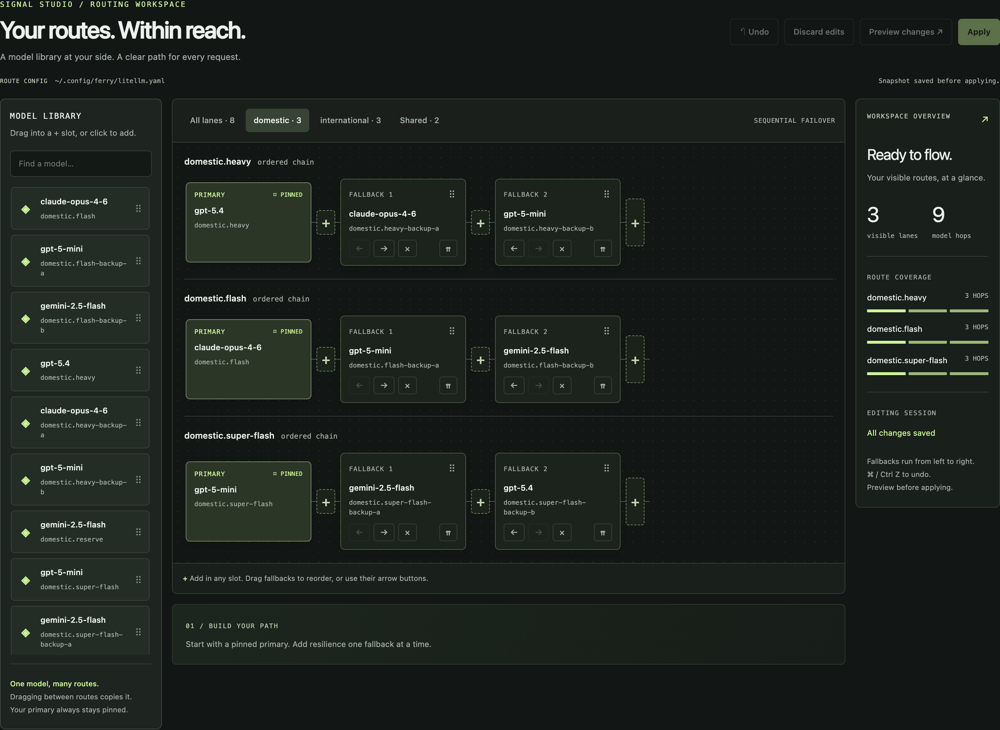
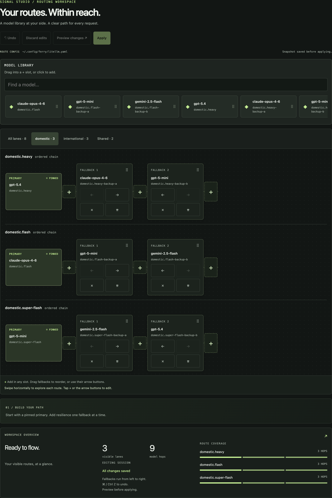
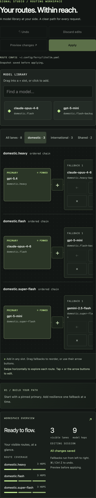
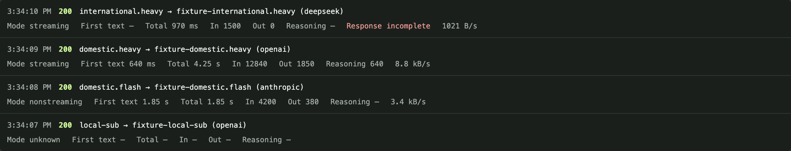

# Signal Studio

Signal Studio is the route workspace inside `ferry dash`. It combines editable fallback chains and a live request feed with a searchable library that keeps every configured model group and also browses the live public OpenRouter catalog. The layout adapts from a desktop canvas to horizontal model strips and tap controls on tablets and phones.

```bash
ferry dash --open            # opens http://localhost:8091 on the host
```

The dashboard binds to localhost by default. Its responsive layouts also work when accessed through an appropriate connection to the host; starting it does not publish a new LAN dashboard endpoint.

## See the workspace

These are actual captures of the v1.28 route workspace, before the live OpenRouter catalog was added, using **synthetic demonstration data**. The models, traffic, latencies, and token counts illustrate the interface; they are not benchmark results or a production account's activity. Tablet and phone captures use Chrome viewport sizes, not physical iPad/Safari testing. Click an image for its full resolution.

**Desktop — the library, route canvas, and overview together.**

<a href="images/signal-studio-desktop.png"></a>

**Tablet — a horizontal model library with larger controls.**

<a href="images/signal-studio-ipad.png"></a>

**Phone — tap to edit, swipe each route to see its remaining hops.**

<a href="images/signal-studio-mobile.png"></a>

## Build a fallback route

A lane is the name a client requests. Its first card is the **pinned primary**; the cards after it are fallback model groups, ordered from left to right. Multiple deployments within one group remain a pool. The configured section of the library retains the groups already present in the host's configuration. These are the cards that can be added to routes with the existing drag, tap, and keyboard controls.

The separate OpenRouter section retrieves the [public model catalog](https://openrouter.ai/docs/api/api-reference/models/list-all-models-and-their-properties). Search results show the model name and ID, context length, current prompt and completion prices per 1 million tokens, and reported input/output modalities and supported parameters. Open a result for its details, then use **Copy model ID** or **View on OpenRouter**. Catalog prices describe the current API result; they are not benchmarks or estimates. A missing value is shown as unknown and is distinct from a price explicitly reported as zero.

Catalog cards are marked **OpenRouter · Not configured** or **OpenRouter · Configured match**. Browsing or refreshing them never creates a deployment, changes the ferry configuration, supplies credentials, or infers which provider you intended to use. A catalog-only result cannot be dragged into a route. When a result exactly matches an OpenRouter model already configured on the host, its details offer **Add _group_ to route** for the matching configured group.

1. **Choose a view.** Use **All lanes**, a fleet tab, or **Shared** for unprefixed lanes when available. The overview counts the lanes and model hops in that view. Changing tabs changes only the editor view.
2. **Find a model.** Search by configured group/model name or browse the separate OpenRouter results by name or ID.
3. **Add it.** Drag a library card into a **+** slot to choose its position. Alternatively, click or keyboard-activate the card and choose a visible route to append it, or activate a route's **+** and choose a group for that exact slot.
4. **Arrange the chain.** Drag a fallback to another slot in the same lane, or use its **← / →** buttons. Dragging a fallback into another eligible lane **copies** it; the source route stays intact. The tap equivalent is adding that same group from the library or **+** picker. Use **×** to remove a fallback.
5. **Review.** Select **Preview changes** to validate the draft and inspect its YAML diff above the workspace. Any later edit invalidates that preview and disables **Apply** until you preview again.
6. **Apply.** The server validates again, saves a timestamped copy of the previous config, writes the new fallback order, and attempts to update the running proxy.

Duplicate groups cannot be added to the same route. Fleet-prefixed routes accept groups from that same fleet. The primary cannot be moved or removed by the fallback controls; changing it uses the separate promotion flow below.

The OpenRouter catalog is cached for 15 minutes. **Refresh** requests a new public snapshot; a short cooldown prevents repeated fetches. If OpenRouter is temporarily unavailable after a successful fetch, Signal Studio keeps the last successful results visible and marks them **Stale catalog** instead of turning an upstream outage into an empty library. The configured model groups remain available regardless of catalog fetch status.

**Read the Apply result.** A successful config write and a successful live update are separate outcomes. If the proxy accepts the hot-swap, no restart is needed. If it is unavailable or refuses the update, the saved file still contains the change and the message explains the live outcome. Investigate a file/router mismatch before restarting. The preview reviews the route order; it is not a lock against concurrent external config edits.

## Undo, discard, and promote

**Undo** or **⌘ / Ctrl Z** reverses draft route edits. The shortcut leaves text inputs and open pickers to their own controls. **Discard edits** returns the draft to its loaded baseline; that discard can itself be undone. Applying successfully clears draft history, so Undo is not a rollback of an applied config. The saved snapshot is the recovery copy for an applied change.

To change the primary, first apply or discard any draft route edits. Select **⇈** on the fallback you want to promote. Review the separate diff, then select **Confirm ⇈** on that card. Promotion swaps the primary and fallback backend definitions while preserving their group names and chain positions. It saves a snapshot and attempts the live update, with the same file/live result distinction as a route-order apply.

## Fleet views and fleet switching

The tabs above the route canvas only filter the editor. A preview and apply include the complete lane map, including lanes hidden by the selected tab.

The separate **Fleets** panel changes the host default or an existing client's sticky fleet selection. Those controls affect routing. An explicit request header can still override a sticky choice or default; see [Fleets in the README](../README.md#fleets) for precedence and CLI commands. Local GPU lanes remain outside the fleet namespace.

## Read live timing and usage

Enable the event tap when starting the inference stack, then open the dashboard:

```bash
FERRY_EVENTS=on ferry up
ferry dash --open
```

For an already running stack, restart it with the event tap enabled. A standalone dashboard's `--events` option can point to a nondefault event file. Passive observation makes no extra inference calls; **Test backends** is a separate action that calls providers.

<a href="images/signal-studio-metrics.png"></a>

| Field | What it measures |
|---|---|
| **Mode** | Whether the client requested streaming or nonstreaming; unknown when the event does not record it. |
| **First text** | Time until the gateway observes output text. Reasoning and tool-call-only output do not count. For nonstreaming responses, this is when the completed text response is observed, not the provider's internal generation start. |
| **Total** | Measured duration through the final response body, or until an interrupted response stops. |
| **In** | Provider-reported input tokens. OpenAI input includes cached input; Anthropic input excludes it. |
| **Out** | Provider-reported output tokens, including reasoning when reported. |
| **Reasoning** | A subset of Out. Never add it to Out to calculate a total. |
| **Response: incomplete** | The response did not finish; its timing and usage can be partial. |

Hover the metrics for response-start time, cached-input count, and completion status. **`—` means unknown, not zero**: old events or providers that omit usage leave fields unknown, while an explicit reported zero stays zero. Unsupported or oversized response payloads can also leave metrics unknown because the observer inspects bounded fragments. Anthropic synthetic zero-only usage is left unknown without evidence of provider-reported usage.

Deployment median latency uses measured total duration. Its throughput display is **response bytes divided by measured total time**, shown as B/s, kB/s, or MB/s; it is not tokens per second. These deployment statistics come from events this page has seen, with median and byte rate drawn from up to the latest 20 events per deployment. The request feed retains up to 200 events. Use the [Grafana stack](../observ/README.md) for persistent history, and the [metric contract](../observ/CONTRACT.md#request-timing-and-token-fields) for the detailed wire semantics.
